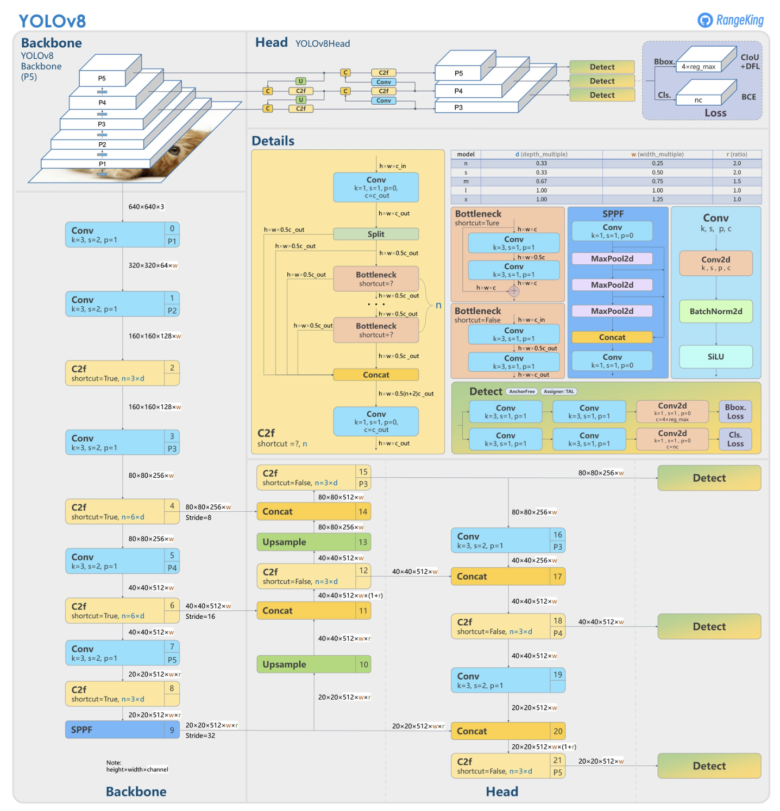
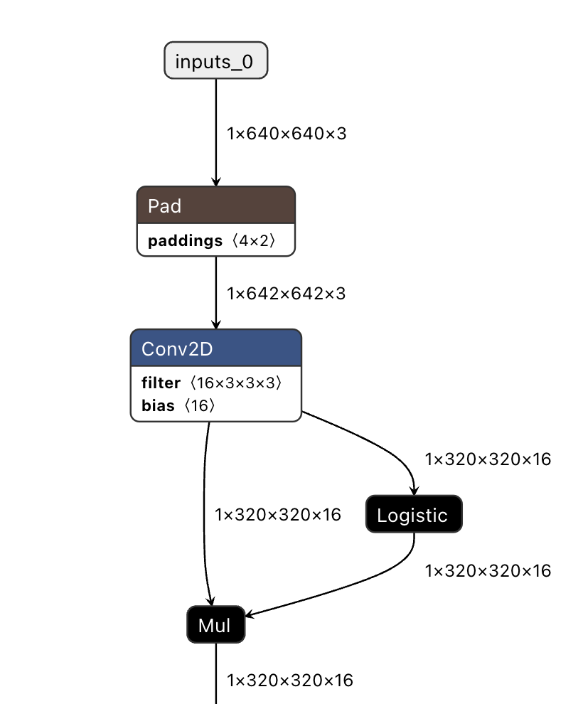
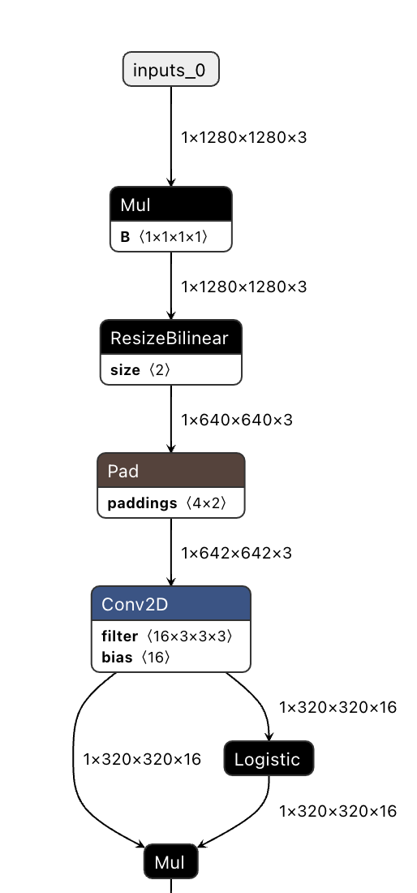
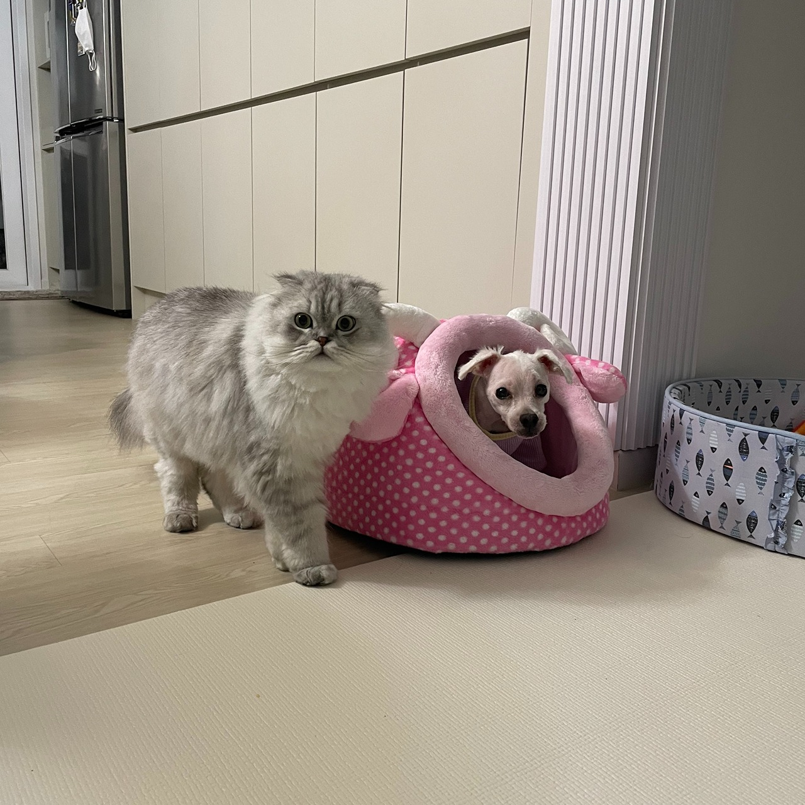

# yolo-custom-export
Code to modify the ultralytics yolo architecture while exporting to TFLite
## Background
I have extensively utilized [ultralytics](https://github.com/ultralytics/ultralytics) for some projects and wanted to note some parts that were useful.
Originally, I had a `.tflite` YOLO model that takes an `(1x640x640x3)` tensor as an input. However, the images that were used to test the model had a shape of `(1x1280x1280x3)` which required a `resize` step. Additionally, the model required a normalization step which is to divide the input tensor by 255 and convert it to `float`.
Therefore, I wanted to include the **resize** and **normalization** steps within the `tflite` model to avoid that hassle.
Complete source code with example images and models can be found [here](https://github.com/k223kim/yolo-custom-export).
## YOLO Architecture
```python
import torch
from ultralytics import YOLO

yolo_model = YOLO() # this will load a default detection YOLO model
# To add your specific YOLO model, do the following
# model = YOLO('path/to/model.pt')
```
#### Model
Let's break down the `yolo_model`.
- `yolo_model` is a `<class 'ultralytics.models.yolo.model.YOLO'>` which looks something like this:
```python
YOLO(
	 (model): DetectionModel(
		 (model): Sequential(
			 (0): Conv(
				 ...
			 )
			...
		...
	...
```
#### YOLO Sequential
- `torch.nn.modules.container.Sequential`
	- model architecture is often defined using `Sequential` that contains multiple torch `Module`s
	 - `forward()` method accepts any input and forward it to the first module
	 - it chains the outputs to inputs sequentially for each subsequent module
	 - returns the output of the last module
- To access the model architecture of ultralytics YOLO, it can be done like so:
```python
model.model.model
"""
Sequential(
	(0): Conv(
		(conv): Conv2d(3, 16, kernel_size=(3, 3), stride=(2, 2), padding=(1, 1), bias=False)
		(bn): BatchNorm2d(16, eps=0.001, momentum=0.03, affine=True, track_running_stats=True)
		(act): SiLU(inplace=True)
	)
	...
)
"""
```
- Each `Module` in the `Sequential` can be accessed using a `for` loop
```python
my_sequential = model.model.model
for each_module in my_sequential:
	print(type(each_module)) #<class 'ultralytics.nn.modules.conv.Conv'>
	break
```
- How does the `Sequential` chain the outputs and inputs for each module?
	- Each `Module` has a `f` and `i` field that describes the following
	- `f`
		- The layer index which passes its output to the current layer
		- When it is `-1`, it means that it gets the input from the previous layer
	- `i`
		- Current layer (`Module`) index
- Some examples
Consider the following architecture of YOLOv8 provided by GitHub user RangeKing.

Notice that the last block denoted by `Detect` is the 22nd module of the entire architecture that takes input from the 15th, 18th, and 21st `C2f` block. This can be confirmed by the following code block.
```python
yolo_sequential = yolo_model.model.model # access to the sequential container
detect_block = yolo_sequential[-1] # access the last module
print(detect_block.i) # 22
print(detect_block.f) # [15, 18, 21]
```
Let us consider another example. Take a look at block #20 `Concat`. It takes input from block #9 and #19. This can also be confirmed by the following code block.
```python
concat_block = yolo_sequential[20]
print(concat_block.i) # 20
print(concat_block.f) # [-1, 9]
```
Notice as block #20 takes the output of the **previous** block (#19) directly as its input, `f` includes `-1`.
- When `f` something other than `-1`, how does the model access the specific module's output?
That is done using an attribute of `ultralytics.nn.tasks.DetectionModel` called `save` that can be accessed as shown below.
```python
detection_model = yolo_mode.model
print(detection_model.save)
# [4, 6, 9, 12, 15, 18, 21]
```
When carefully considering each module in `save`, they are the modules that are needed for the `concat` block (which is obvious as the `concat` will need additional modules than its previous module) or the `detect` block. To confirm, you can check the implementation of the `save` attribute [here](https://github.com/ultralytics/ultralytics/blob/f9edac6a089db168fb17eaed6d3048a84cf92a50/ultralytics/nn/tasks.py#L919):
```python
save.extend(x % i for x in ([f] if isinstance(f, int) else f) if x != -1)  # append to savelist
```
This shows that modules are added to `save` only if they take inputs from other modules other than its previous module's output.

## Creating new `Module` to insert
Let us create a module that we want to insert into our `tflite` model. We have two objectives; resize and normalization. Let us create a `module` as shown below. This new `module` needs two attributes; `f` and `i` just like any other module in YOLO.
```python
class newModule(torch.nn.Module):
	def __init__(self):
		super(newModule, self).__init__()
		self.f = -1
		self.i = 0
	def forward(self, x):
		return x
```
As we are inserting a `module` that performs a **preprocessing step** of the model, therefore we know that this `module` will be the **first** (or zeroth index) module of the model. That is why `i = 0` and `f = -1` (this means that it simply takes the input of the model).
#### Resize
Resize to `640x640` can be done as the following
```python
x = torch.nn.functional.interpolate(x, (640, 640), mode='bilinear')
```
#### Normalization
Dividing the tensor by `255` and converting the data type to `float` is shown below.
```python
x = torch.div(x, 255.).to(dtype=torch.float)
```
#### New Module
Adding each step to `forward` would complete the `newModule`.
```python
class newModule(torch.nn.Module):
	def __init__(self):
		super(newModule, self).__init__()
		self.f = -1
		self.i = 0
	def forward(self, x):
		x = torch.div(x, 255.).to(dtype=torch.float)
		x = torch.nn.functional.interpolate(x, (640, 640), mode='bilinear')
		return x
```
## Modifying YOLO Architecture
Having the new module that we want to insert, all we are left with is to **insert** the module to the `sequential`. I have simply created a new `torch.nn.Sequential` and added the `newModule` along with the other modules in YOLO `Sequential` using `extend`.
```python
# create deep copy of the yolo model so that we can modify it
import copy

yolo_model_new = copy.deepcopy(yolo_model)
# create a new sequential with the new module added
new_module = newModule()
new_sequential = torch.nn.Sequential(new_module)
for module in yolo_model_new.model.model:
	module.i += 1
	if isinstance(module.f, list):
		new_f = []
		for each_f in module.f:
			if each_f == -1:
				new_f.append(each_f)
			else:
				new_f.append(each_f + 1)
	module.f = new_f

# add that to the original model
yolo_model_new.model.model = new_sequential.extend(yolo_model_new.model.model)
```
Notice how `f` and `i` were incremented by `1` as we added a **single** module to `Sequential`. Also, note how `-1` did not change as it indicates the **previous module**.
Don't forget to update the `save` attribute as well.
```python
new_save = []
for each_idx in yolo_model_new.model.save:
	new_save.append(each_idx + 1)

# overwrite the original save attribute
yolo_model_new.model.save = new_save
```
Similarly, the module indices in the `save` attribute has been incremented by `1`.
## Export
#### Default Export
```python
yolo_model.export(format='tflite')
```
When performing a default export, the model looks something like this:

#### Modified Export
```python
yolo_model_new.export(format='tflite', imgsz=(1280, 1280))
```
With the new module inserted and assigning a specific input tensor shape while exporting, the YOLO architecture is modified as shown below.


Notice how the input shape is now converted to `1x1280x1280x3` and there are two "blocks" that are added that normalizes and reshapes the tensor to `1x640x640x3`. The rest of the model architecture is identical.
## Inference TFLite Model
Let us confirm that this modification has been done correctly by running an inference on the TFLite model. Below are the code to run a the TFLite model on a single image.
#### Set up TensorFlow Lite Interpreter Interface
```python
import io
import tensorflow as tf
import numpy as np
import cv2
from datetime import datetime

start_time = datetime.now()
image_path = '/path/to/image.png'
interpreter = tf.lite.Interpreter(model_path="/path/to/model.tflite")
interpreter.allocate_tensors()
```
- [`tf.lite.Interpreter`](https://www.tensorflow.org/api_docs/python/tf/lite/Interpreter) is an interface for running TensorFlow Lite models
- `allocate_tensors()` is required before any inference as TensorFlow Lite pre-plans tensor allocations to optimize inference
#### Get Input Tensor
```python
input_details = interpreter.get_input_details()
output_details = interpreter.get_output_details()
```
- This allows us to get the desired input and output tensor information such as shape of the tensor, data type, index, etc. Here, what we are interested in is the input and output tensor **shape**
```python
input_shape = input_details[0]['shape']
# array([ 1, 224, 224, 3], dtype=int32)
```
- Now we need the actual image which is going to read an image using `cv2`
```python
image = cv2.imread(image_path)
image = cv2.cvtColor(image, cv2.COLOR_BGR2RGB)
image_size = image.shape[:2]
image = cv2.resize(np.copy(image), (640, 640))
#to match the desired input shape

image_data = np.array(image)
image_data = image_data / 255.
image_data = image_data[np.newaxis, ...].astype(np.float32)
```
- Finally, we have to set the value of the input tensor (Note that `set_tensor` copies the the data; if you don't want to copy the data consider using [`tensor()`](https://www.tensorflow.org/api_docs/python/tf/lite/Interpreter#tensor))
```python
interpreter.set_tensor(input_details[0]['index'], image_data)
```
#### Running the Model & Retrieving Results

```python
interpreter.invoke()
output_data = interpreter.get_tensor(output_details[0]['index'])
```
- Similarly, `get_tensor()` will copy the value of the output tensor. [`tensor()`](https://www.tensorflow.org/api_docs/python/tf/lite/Interpreter#tensor) can be used to get the pointer to the output tensor.
#### Comparing two `tflite` models
Here is the example image that I am going to use which is an image of my dog and cat.

As mentioned earlier, this image has a shape of `1280x1280`. Below is the complete code to run inference on two different `tflite` models with the same input image.
```python
import tensorflow as tf
import numpy as np
import cv2
import argparse

def get_image(image_path):
    image = cv2.imread(image_path)
    image = cv2.cvtColor(image, cv2.COLOR_BGR2RGB)
    return image

def load_tflite(model_path):
    interpreter = tf.lite.Interpreter(model_path=model_path)
    interpreter.allocate_tensors()
    input_details = interpreter.get_input_details()
    output_details = interpreter.get_output_details()
    return interpreter, input_details, output_details

def run_inference(interpreter, input_details, output_details, image):
    image_data = image
    input_shape = tuple(input_details[0]['shape'][1:3])
    if input_shape != image.shape[:2]:
        image_data = cv2.resize(np.copy(image), input_shape)
        # if the shape is different assume that normalization has to be done as well
        image_data = np.array(image_data)
        image_data = image_data / 255.
    image_data = image_data[np.newaxis, ...].astype(np.float32)

    interpreter.set_tensor(input_details[0]['index'], image_data)
    interpreter.invoke()
    output_data = interpreter.get_tensor(output_details[0]['index'])
    return output_data

if __name__ == "__main__":
    parser = argparse.ArgumentParser(description='TFLite comparison')
    parser.add_argument('--model', type=str,  help="path/to/model.tflite", default="/path/to/model.tflite")
    parser.add_argument('--newModel', type=str,  help="path/to/new_model.tflite", default="/path/to/new_model.tflite")
    parser.add_argument('--image', type=str,  help="path/to/image.jpg", default="path/to/image.jpg")
    args = parser.parse_args()

    img = get_image(args.image)
    interpreter_original, input_details_original, output_details_original = load_tflite(args.model)
    interpreter_new, input_details_new, output_details_new = load_tflite(args.newModel)
    output_original = run_inference(interpreter_original, input_details_original, output_details_original, img)
    output_new = run_inference(interpreter_new, input_details_new, output_details_new, img)
    assert np.allclose(output_original, output_new, atol=1e-1) == True
```
#### Interesting notes
- Why did I choose to perform **bilinear interpolation** for both `cv2.resize` and `torch.nn.functional.interpolate`?
	- That is because, when training the YOLO model, the model `resize`s the image using `torchvision.transforms.Resize` which has a default interpolation mode of `bilinear` (see [here](https://pytorch.org/vision/main/generated/torchvision.transforms.Resize.html))
	- To be consistent with the `torch` model and the `tflite` model, I figured that the interpolate mode should match
- How come the outputs are not exactly the same?
	- I suspect two things
	- `interpolate` step
		- when resizing using `interpolate`, it can result in slightly different results in `cv2.resize` and in `torch.nn.functional.interpolate`
	- normalization step
		- as we convert the tensor into `float32` , there can be a small discrepancy between numpy and torch.
